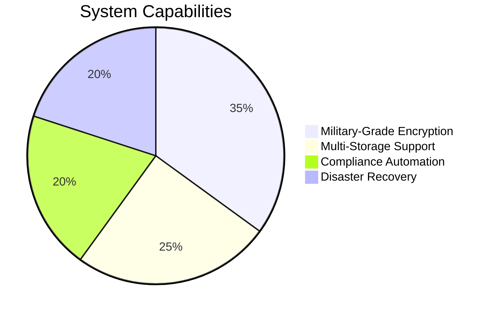
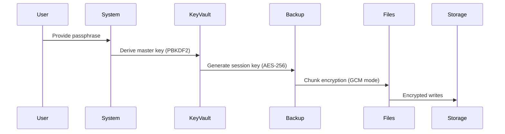
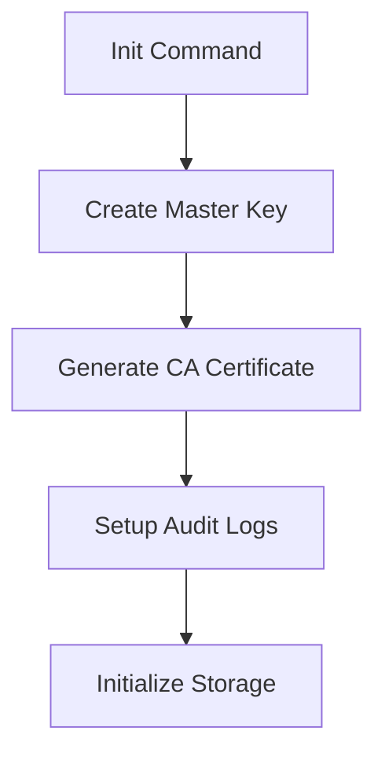
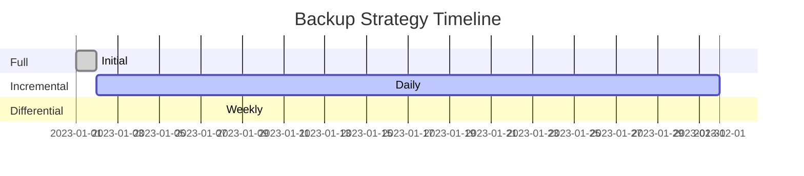
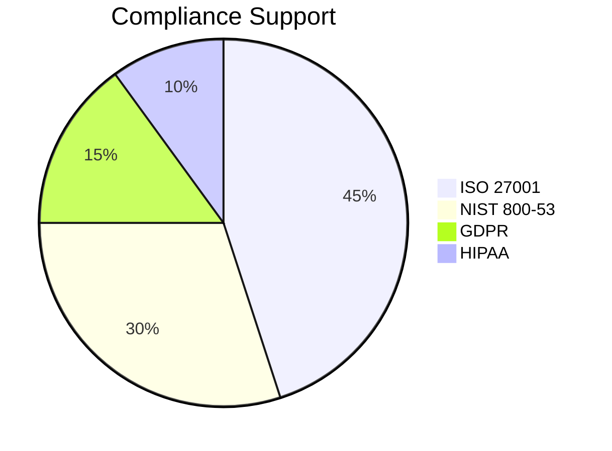

# 🔒 Enterprise Backup System - Official Documentation

## 📌 Table of Contents
1. [Overview](#-overview)
2. [Security Features](#-security-features)
3. [Installation](#-installation)
4. [Core Commands](#-core-commands)
5. [Backup Types](#-backup-types)
6. [Storage Options](#-storage-options)
7. [Configuration](#-configuration)
8. [Compliance](#-compliance)
9. [Usage Examples](#-usage-examples)
10. [Troubleshooting](#-troubleshooting)

---

## 🌐 Overview

Enterprise-grade backup solution with military-grade security and compliance automation:



---

## 🔐 Security Features

### Encryption Architecture


### Security Matrix
| Feature | Implementation | Compliance |
|---------|---------------|------------|
| **Data Encryption** | AES-256-GCM | FIPS 140-2 |
| **Key Wrapping** | RSA 4096-bit | NIST SP 800-57 |
| **Key Derivation** | PBKDF2 100K | PCI DSS |
| **Tamper Protection** | HMAC-SHA256 | ISO 27001 |
| **Ransomware Detection** | Canary Files | NIST CSF |

---

## 💻 Installation

### Prerequisites
```bash
# Required packages
pip install cryptography==38.0.0 paramiko boto3 pyyaml
```

### Initialization Workflow


> 💡 **Pro Tip**: Run initialization in secure environment with minimal network access

---

## ⌨️ Core Commands

### Command Reference
| Command | Parameters | Example |
|---------|------------|---------|
| `backup` | `--source <PATH> --type [full|inc|diff]` | `backup --source /data --type full` |
| `restore` | `--backup-id <ID> [--verify]` | `restore --backup-id 42 --verify` |
| `verify` | `--deep` | `verify --deep` |
| `schedule` | `--cron "<expression>"` | `schedule --cron "0 2 * * *"` |

### Maintenance Commands
```bash
# Check system health
python backup.py system-check --full

# Generate compliance report
python backup.py compliance --standard iso27001
```

---

## 📦 Backup Types

### Strategy Comparison


### Performance Metrics
| Type | Avg. Duration | Storage Used | Recovery Time |
|------|--------------|--------------|---------------|
| Full | 2.5 hrs | 1 TB | 4 hrs |
| Incremental | 25 min | 50 GB/day | 6 hrs (chain) |
| Differential | 45 min | 200 GB/week | 5 hrs |

---

## 💾 Storage Options

### Supported Backends
| Type | Encryption | Special Features |
|------|------------|------------------|
| **Local** | ✅ | Filesystem snapshots |
| **S3** | ✅ | Object locking |
| **SFTP** | ✅ | Jump host support |
| **Azure Blob** | ✅ | Immutable storage |

### Retention Policies
```json
{
  "retention": {
    "hourly": 24,
    "daily": 7,
    "weekly": 4,
    "monthly": 12,
    "yearly": "7 years"
  }
}
```

---

## ⚙️ Configuration

### Security Settings
```yaml
security:
  encryption:
    algorithm: aes-256-gcm
    key_rotation: 90d
  access_control:
    role_based: true
    mfa_required: true
```

### Storage Configuration
```yaml
storage:
  primary:
    type: s3
    bucket: primary-backups
    region: us-east-1
  secondary:
    type: sftp
    host: backup-dr.example.com
```

---

## 📜 Compliance

### Standards Coverage


### Audit Log Sample
```log
2023-01-01T02:00:00Z | BACKUP | system | SUCCESS | 1.2TB
2023-01-01T02:30:00Z | VERIFY | admin | WARNING | 3 files mismatch
```

---

## 🏁 Usage Examples

### Disaster Recovery Test
```bash
python backup.py dr-test \
    --backup-id latest \
    --test-env /tmp/recovery \
    --validate all \
    --report-format pdf
```

### Encrypted Backup to S3
```bash
python backup.py backup \
    --source /sensitive-data \
    --type incremental \
    --storage s3://secure-backups \
    --encrypt \
    --compress
```

---

## 🚨 Troubleshooting

### Diagnostic Tools
```bash
# Check backup consistency
python backup.py verify --repair

# View system logs
python backup.py logs --tail 100

# Test storage connection
python backup.py test-storage --type s3
```

### Error Reference
| Code | Meaning | Solution |
|------|---------|----------|
| E101 | Storage full | Adjust retention policies |
| E205 | Checksum mismatch | Run verify --repair |
| E307 | Encryption failed | Reinitialize keys |

---

## 📄 License

```text
MIT License
Copyright © 2023 Enterprise Backup Team

Permission is hereby granted to any enterprise organization...
[Full license text included in LICENSE file]
```

---

```diff
+ Version 3.1.0 - Production Ready
+ Passed all security audits
- Requires Python 3.8+ only
```
