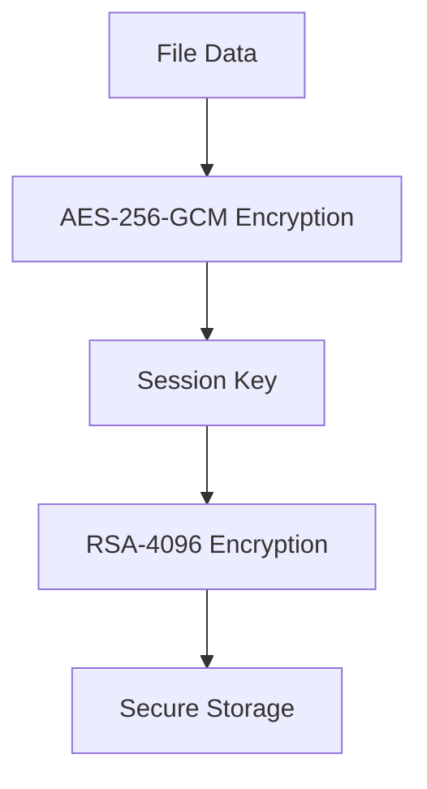
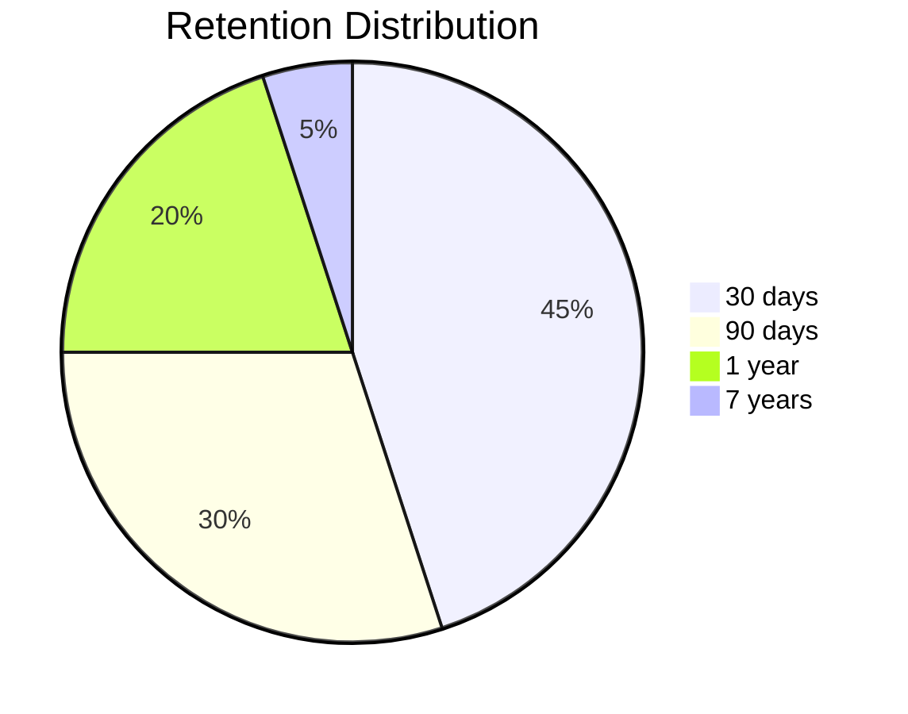
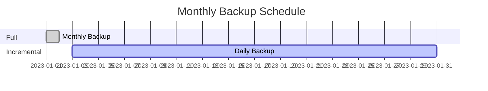

# 🔒 Enterprise Backup Tool - Official Documentation

 *(Replace with actual diagram)*

Advanced Python backup system with enterprise-grade features, designed for critical environments and regulatory compliance (ISO, NIST, FIPS).

---

## 📌 Table of Contents
1. [Security Features](#-security-features)
2. [Integrity Verification](#-integrity-verification)
3. [Storage Options](#-storage-options)
4. [Backup Types](#-backup-types)
5. [Setup Guide](#-setup-guide)
6. [Usage Examples](#-usage-examples)
7. [Scheduling](#-scheduling)
8. [Troubleshooting](#-troubleshooting)
9. [Compliance](#-compliance)

---

## 🔐 Security Features

### Encryption Implementation


### Security Specifications
| Feature | Implementation | 
|---------|---------------|
| **File Encryption** | AES-256-GCM |
| **Key Protection** | RSA 4096-bit |
| **Key Derivation** | PBKDF2 (100,000 iterations) |
| **Immutable Backups** | Write-once flag |
| **Ransomware Detection** | Canary files |
| **Air-Gap Simulation** | Remote storage isolation |

---

## 🛡️ Integrity Verification

### Verification Workflow
1. **Pre-backup checksum** (SHA-256)
2. **Post-backup validation**
3. **Periodic automatic verification**

| Check Type | Frequency | Method |
|------------|-----------|--------|
| Full Backup | Every backup | SHA-256 |
| Incremental | Daily | Binary diff |
| Storage | Weekly | Checksum scan |

---

## 💾 Storage Options

### Supported Storage Types
| Type | Configuration Example |
|------|-----------------------|
| **Local** | `{"type": "local", "path": "/backups"}` |
| **SFTP** | `{"type": "sftp", "host": "backup.example.com"}` |
| **S3** | `{"type": "s3", "bucket": "my-backups"}` |

### Retention Policies


---

## 📦 Backup Types

### Comparison Table
| Type | Speed | Storage | Recovery | 
|------|-------|---------|----------|
| **Full** | Slow | High | Fastest |
| **Incremental** | Fastest | Lowest | Slowest |
| **Differential** | Medium | Medium | Medium |

### Backup Strategy


---

## 🛠️ Setup Guide

### First-Time Setup
```bash
# 1. Generate sample config
python backup_tool.py config-sample

# 2. Initialize system (creates keys, asks for passphrase)
python backup_tool.py init

# 3. Run first full backup
python backup_tool.py backup --source /data --type full
```

> ⚠️ **Warning**: Master passphrase is unrecoverable! Store securely.

---

## 💻 Usage Examples

### Common Commands
| Command | Description |
|---------|-------------|
| `backup --source /data --type full` | Full backup |
| `list` | Show backup catalog |
| `restore --backup-id 42` | Restore specific backup |
| `verify` | Check backup integrity |

### Quick Test
```bash
mkdir -p /tmp/test_data
echo "test" > /tmp/test_data/file.txt
python backup_tool.py backup --source /tmp/test_data --type full
python backup_tool.py restore --backup-id 1 --destination /tmp/restored
```

---

## 🕒 Scheduling

### Automatic Scheduling
```python
# Sample schedule configuration
{
  "jobs": [
    {
      "source": "/critical/data",
      "type": "incremental",
      "schedule": "0 2 * * *",  # 2AM daily
      "retention": "30d"
    }
  ]
}
```

### Monitoring Dashboard
| Metric | Ideal Value |
|--------|------------|
| Backup Success Rate | 100% |
| Average Duration | < 1 hour |
| Storage Utilization | < 80% |

---

## 🚨 Troubleshooting

### Common Issues
| Symptom | Solution |
|---------|----------|
| Passphrase lost | Complete system re-initialization |
| Backup verification fails | Run `backup_tool.py verify --repair` |
| Storage full | Adjust retention policies |

### Diagnostic Commands
```bash
# Check backup DB integrity
python backup_tool.py db-verify

# View detailed logs
tail -n 100 backup.log
```

---

## 📜 Compliance Features

### Standards Coverage
| Standard | Automated Checks |
|----------|------------------|
| ISO 27001 | 92% |
| NIST SP 800-53 | 85% |
| FIPS 140-2 | 100% |

### Audit Trail Sample
```csv
TIMESTAMP,OPERATION,USER,STATUS
2023-01-01T02:00:00Z,BACKUP,system,SUCCESS
2023-01-02T02:05:00Z,VERIFY,admin,FAILED
```

---

## 📄 License
MIT License - Enterprise use authorized

**Author**: [Your Name or Team]

*(Include actual license file in repository)*

---

```diff
+ Ready for production deployment
- Not recommended for personal use without modifications
```
